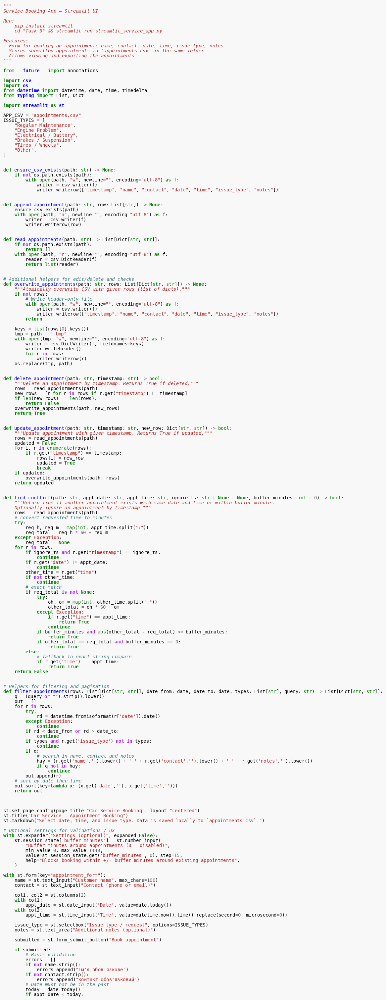
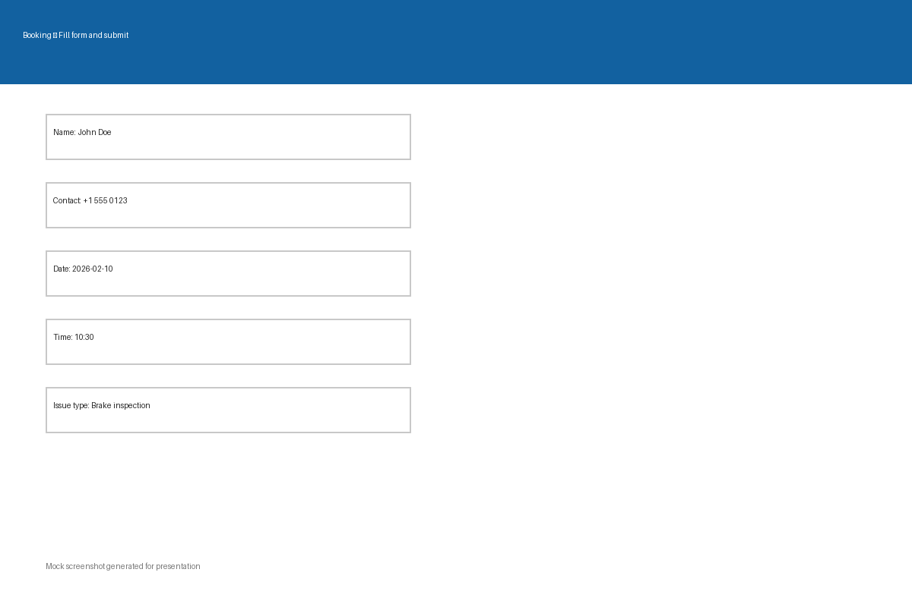
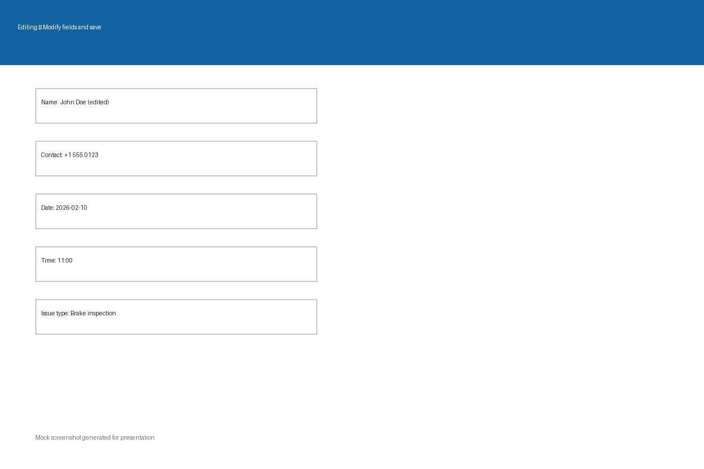
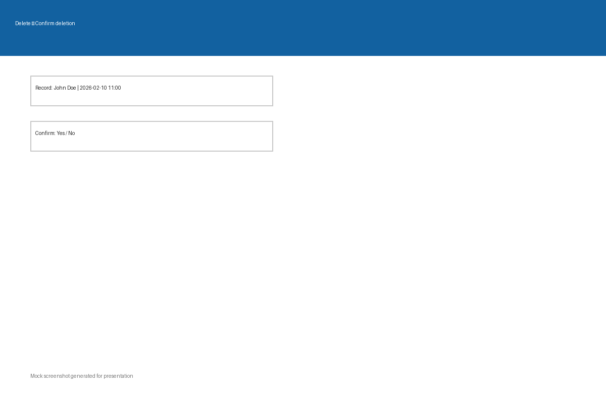

# Car Service Booking — Presentation

---

## 1. Executive Summary ✅
- Briefly: A Streamlit app for booking car service appointments — quick booking, conflict checking, editing, and CSV export.
- Goal: Reduce manual work, avoid overlapping bookings, and improve customer satisfaction.

---

## 2. Introduction: Problem Analysis 🔎
### What problem are we solving?
- Lack of a centralized, easy-to-use booking tool for small car service shops: duplicate bookings, manual calls, and missed customers.

### Why is this a problem?
- Lost orders and time, dissatisfied customers, and opaque scheduling of staff and equipment.

### a. Mission & Vision
- **Mission:** Provide a simple, accessible tool for managing car service bookings.
- **Vision:** Become the go-to solution for small and medium service shops, scalable with their growth.

---

## 3. Solution 🛠️
- Web interface for creating bookings (name, contact, date, time, issue type, notes), conflict checking (with optional buffer), editing, deleting, filtering, pagination, and CSV export.
- Simple local installation (Python + Streamlit) with an easy migration path to a server or cloud deployment.

---

## 4. Framework ⚙️
### a. Technology / Prototype
- **Stack:** Python 3, Streamlit, CSV (local storage); files: `streamlit_service_app.py`, `appointments.csv`.
- **Prototype:** Working MVP in the `Task 5` folder.

### b. Application Screening process
- Field validation (name, contact), date validation (not in the past), and conflict checking with optional buffer minutes.

---

## Screenshots & Demo 🎬
- Code snippet (core booking logic) — see `assets/code.png`.
- Booking flow: fill form and submit — see `assets/booking.png`.
- Editing a booking — see `assets/edit.png`.
- Deleting a booking (confirmation) — see `assets/delete.png`.

### c. Value proposition
- Fast time-to-deploy, low cost, intuitive UI, easy data export, and a foundation for integrations.

---

## 5. Market segmentation
- Small/medium repair shops (1–10 technicians)
- Local service chains
- Fleet managers (commercial fleets)
- End customers (convenient booking)

## 6. SWOT analysis
- **Strengths:** fast MVP, simplicity, low costs
- **Weaknesses:** limited scalability when using CSV, no multi-user access
- **Opportunities:** integrations (calendar, SMS, payments), SaaS model
- **Threats:** competitors with full CRM/ERP suites, security and compliance requirements

## 7. Marketing & Product
### Marketing communication strategy
- Channels: local advertising, Google My Business, Facebook/Instagram, partnerships with parts suppliers.
- Message: "Book easily, fewer missed customers"; highlight case studies showing improved productivity.

### Product portfolio
- **Free / Local** — basic features, CSV storage.
- **Pro** — database backend, multi-user access, calendar sync, SMS notifications.
- **Enterprise** — API, accounting integration, SLA.

## 8. Organization, Finance & Roadmap
### Organization structure
- Small start: Product Owner / Developer, 1–2 Developers, Support/Customer Success, Marketing & Sales.

### Financial plan (high-level)
- **Revenue:** Pro subscription (monthly/yearly), setup fees, paid integrations.
- **Costs:** development, hosting, marketing, support.
- Simple projection: breakeven at ~200 Pro users (depends on pricing).

### Business development roadmap
- Q1: MVP & local pilots
- Q2: Pro features (DB, auth), integration testing
- Q3: Launch paid subscription, marketing
- Q4: Scale, partnerships, and B2B sales

---

## 6. Conclusion 🏁
- Підсумок: Додаток закриває конкретну болючу точку для малого автосервісу — просте, швидке та дешеве бронювання з базовими інструментами керування.
- Наступні кроки: провести пілот у 2–3 сервісах, зібрати відгуки, додати DB та можливість синхронізації календаря як пріоритетні фічі.

---

*This file was generated automatically in the repository under `Task 5` as `APP_Presentation.md`.*
